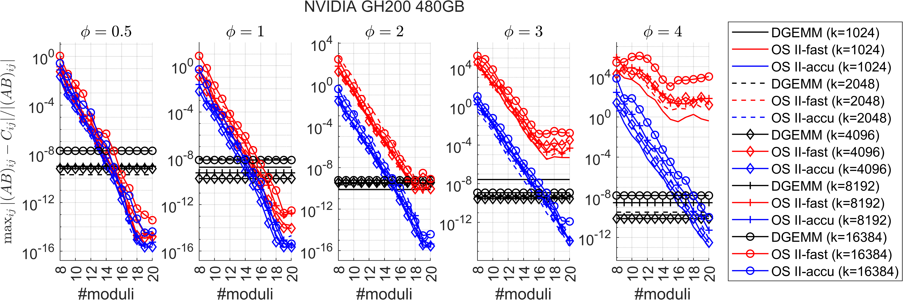
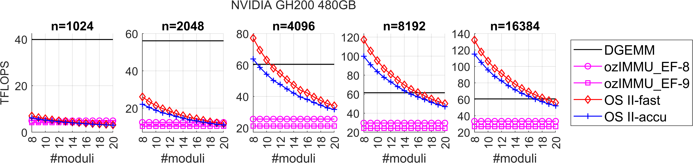
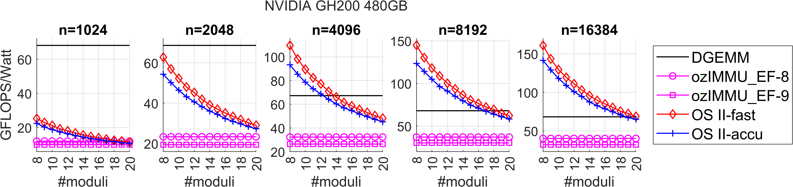
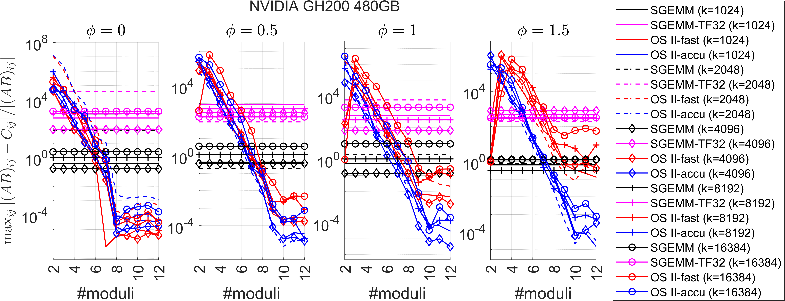
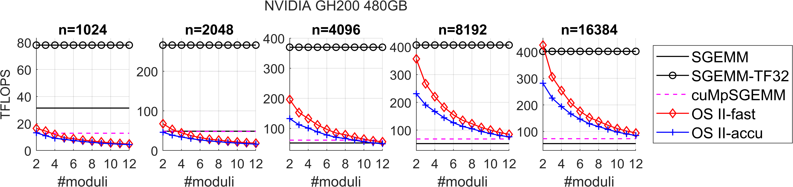
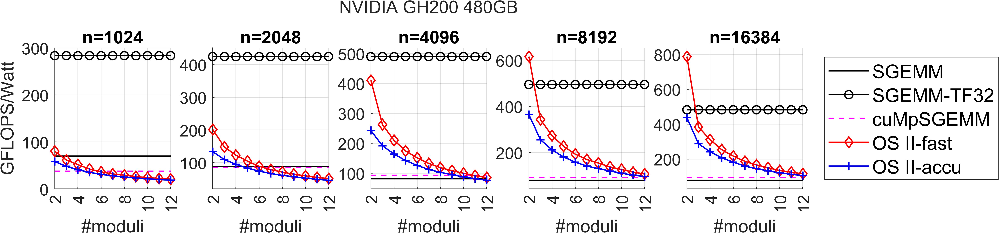

# GEMMul8

GEMMul8 (GEMMulate): GEMM emulation using int8 matrix engines based on the Ozaki Scheme2.

## Build

1. (Option) Build `cuMpSGEMM` and `ozIMMU_EF` according to [cuMpSGEMM](https://github.com/enp1s0/cuMpSGEMM) and [ozIMMU](https://github.com/enp1s0/ozIMMU) (see also [Accelerator for ozIMMU](https://github.com/RIKEN-RCCS/accelerator_for_ozIMMU)).

2. Navigate to the `GEMMul8` directory and modify the following values in the `Makefile` and `testing/Makefile` to the appropriate values:

   - `CUDA_PATH`: path to cuda (e.g., `CUDA_PATH := /usr/local/cuda-12.8`)
   - `ozIMMU_EF`: `yes` if the ozIMMU_EF is used in sample codes (e.g., `ozIMMU_EF := yes`)
   - `ozIMMU_EF_DIR`: path to ozIMMU_EF (e.g., `ozIMMU_EF_DIR := path/to/ozIMMU_EF`)
   - `cuMpSGEMM`: `yes` if the cuMpSGEMM is used in sample codes (e.g., `cuMpSGEMM := yes`)
   - `cuMpSGEMM_DIR`: path to cuMpSGEMM (e.g., `cuMpSGEMM_DIR := path/to/cuMpSGEMM`)
   - Note: Please specify `ozIMMU_EF_DIR` and `cuMpSGEMM_DIR` as the parent directories of `build` directories, i.e., `build` directories are located as `ozIMMU_EF_DIR/build` and `cuMpSGEMM_DIR/build`.

3. Run `make` in the `GEMMul8` directory to compile all files.

4. Navigate to the `testing` directory and then run following commands to run sample codes.
   - `make test_f MODE="mode1 mode2 mode3"` (testrun for SGEMM emulation)
   - `make test_d MODE="mode1 mode2 mode3"` (testrun for DGEMM emulation)
   - mode list:
     - `accuracy_check`
     - `flops_check`
     - `watt_check`
     - `all`
   - e.g.,
     - `make test_f MODE="watt_check"`
     - `make test_f MODE="accuracy_check flops_check"`
     - `make test_f test_d MODE="all"`

## Usage

```
//----------
// settings
//----------
const unsigned num_moduli = 14;   // 2 <= num_moduli <= 20 for DGEMM emulation
// const unsigned num_moduli = 6;   // 2 <= num_moduli <= 19 for SGEMM emulation
const bool fastmode = true;       // true (fast-mode) or false (accurate-mode)

//----------
// (if needed) allocate workspace
//----------
const size_t worksize = gemmul8::workSize(m,n,k,num_moduli);
void *work;
cudaMalloc(&work, worksize);

//----------
// (if needed) output variable
//----------
std::vector<double> time_breakdown(4,0);

//----------
// run emulation
// gemmul8::gemm returns execution time (sec.) of each part
//----------
time_breakdown = gemmul8::gemm(cublas_handle,   // Handle to the cuBLAS library context
                               CUBLAS_OP_N,     // non- or transpose devA
                               CUBLAS_OP_N,     // non- or transpose devA
                               m,               // Number of rows of devC
                               n,               // Number of columns of devC
                               k,               // Inner dimension
                               &alpha,          // Scaling factor for devA*devB
                               devA,            // 1-D device array of dimensions lda*k
                               lda,             // Leading dimension of devA
                               devB,            // 1-D device array of dimensions ldb*n
                               ldb,             // Leading dimension of devB
                               &beta,           // Scaling factor for devC
                               devC,            // 1-D device array of dimensions ldc*n
                               ldc,             // Leading dimension of devC
                               num_moduli,      // #moduli (controlling accuracy)
                               fastmode,        // Computing mode
                               work);           // workspace
```

## Numerical results (DGEMM emulation on GH200)

The constant $\phi$ controls the difficulty of matrix multiplication (exponent distribution of input matrices).

The difficulty of $\phi = 0.5$ is comparable to that of matrix multiplication in HPL.

### Accuracy



### Throughput performance



### Power efficiency



## Numerical results (SGEMM emulation on GH200)

### Accuracy



### Throughput performance



### Power efficiency



## Attention

ozIMMU_EF is from [ozIMMU](https://github.com/enp1s0/ozIMMU) by Ootomo and [Accelerator for ozIMMU](https://github.com/RIKEN-RCCS/accelerator_for_ozIMMU) by RIKEN R-CCS.

cuMpSGEMM is from [cuMpSGEMM](https://github.com/enp1s0/cuMpSGEMM) by Ootomo.

If you use these libraries, you must agree to the licenses terms of ozIMMU, Accelerator for ozIMMU, and cuMpSGEMM in addition to the license for GEMMul8.

## References

- Hiroyuki Ootomo and Rio Yokota. 2022. Recovering single precision accuracy from Tensor Cores while surpassing the FP32 theoretical peak performance. The International Journal of High Performance Computing Applications 36, 4 (2022), 475--491.
- Hiroyuki Ootomo, Hidetaka Manabe, Kenji Harada, and Rio Yokota. 2023. Quantum Circuit Simulation by SGEMM Emulation on Tensor Cores and Automatic Precision Selection. In High Performance Computing. Springer Nature Switzerland, Cham, 259--276.
- Hiroyuki Ootomo, Katsuhisa Ozaki, and Rio Yokota. 2024. DGEMM on integer matrix multiplication unit. The International Journal of High Performance Computing Applications 38, 4 (2024), 297--313.
- Yuki Uchino, Katsuhisa Ozaki, and Toshiyuki Imamura. 2025. Performance enhancement of the Ozaki Scheme on integer matrix multiplication unit. The International Journal of High Performance Computing Applications 0, 0 (2025), 10943420241313064.

## Citation

TBD

## License

MIT
